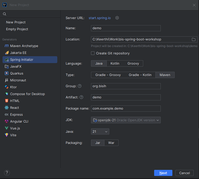
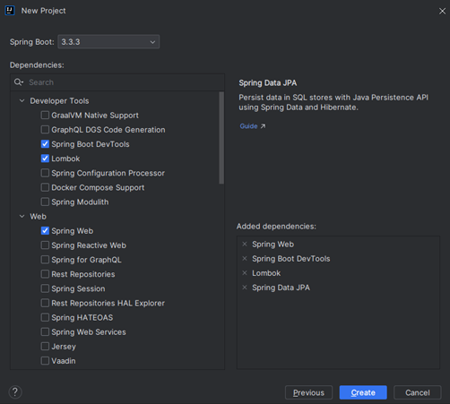
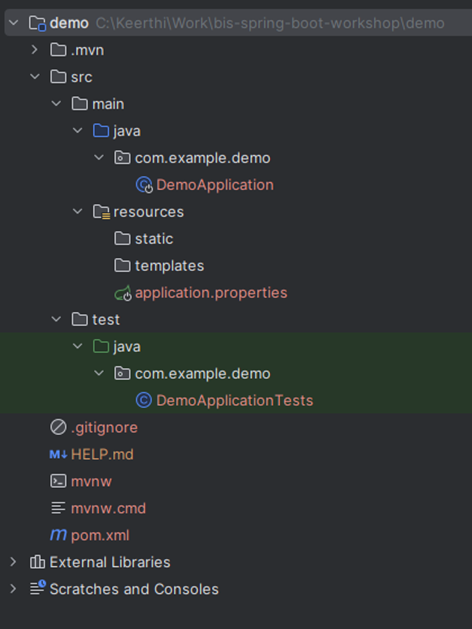
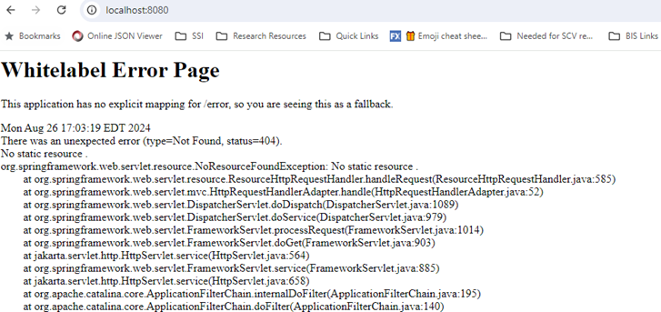

### **Lab 1: Setting Up a Spring Boot Project**

**Objective:**  
In this lab, participants will set up a new Spring Boot project using their chosen IDE (IntelliJ IDEA, Eclipse, or Visual Studio Code). They will configure the necessary dependencies and ensure the project is ready for development.

---

**Steps:**

1. **Create a New Project:**

   **IntelliJ IDEA:**
   - Open IntelliJ IDEA.
   - Click on "File" > "New" > "Project..."
   - In the "New Project" dialog, select "Spring Initializr" from the left-hand menu.
   - Choose "Maven" as the project type (or Gradle if preferred).
   - Set the SDK to Java 17 (or your installed version).
   - Configure Project Metadata:**
        **Group:** `com.example`
        **Artifact:** `demo`
        **Name:** `Demo Application`
        **Description:** A simple Spring Boot application.
        **Package Name:** `com.example.demo`
        **Packaging:** `Jar`
        **Java Version:** 17 (or your installed version)
        
   - Click "Next"

1. **Add Dependencies:**
   - **Spring Web:** For building web, including RESTful applications using Spring MVC. This dependency will add all necessary libraries for creating a basic web application.
   - **Spring Boot DevTools:** For enabling hot-reloading and developer-friendly features.
   - **Lombok (optional):** If you want to reduce boilerplate code (getter, setter, constructors).
   - Click "Create"
    

1. **Review the Generated Project Structure:**
   - In your IDE, you should see the following structure:
     - **src/main/java:** Your main application code.
     - **src/main/resources:** Application properties and static resources.
     - **pom.xml (or build.gradle):** Contains all project dependencies.
        

2. **Modify Application Properties:**
   - Open `src/main/resources/application.properties` (or `application.yml` if you prefer YAML).
   - Add the following configuration to define the server port:
     ```properties
     server.port=8080
     ```
   - This sets your application to run on port 8080. You can choose a different port if needed.

3. **Run the Application:**
   - In your IDE, locate the main class file (`DemoApplication.java`).
   - The file should have a `@SpringBootApplication` annotation.
   - Right-click the file and choose "Run" (or use the IDE's run configuration).
   - Verify that the application starts successfully by checking the console output.

4. **Verify the Setup:**
   - Open a web browser and navigate to `http://localhost:8080`.
   - Since no endpoints are defined yet, you should see a default "Whitelabel Error Page" indicating the server is running but no content is available.
    

5. **Project Cleanup (Optional):**
   - Commit your initial setup to a version control system like Git if needed:
     ```bash
     git init
     git add .
     git commit -m "Initial Spring Boot setup"
     ```

**Completion:**
- You have successfully set up a new Spring Boot project. In the next lab, you will create simple mvc front-end to make your application functional.

---

**Troubleshooting Tips:**
- **IDE Not Recognizing Dependencies:** Ensure your Maven or Gradle build is properly synced. In IntelliJ IDEA, use the "Reload" button in the Maven/Gradle tool window.
- **Java Not Recognized:** Ensure Java is correctly installed and added to your system's PATH.
- **Port Already in Use:** If port 8080 is occupied, choose a different port by modifying `server.port` in `application.properties`.

These detailed instructions should guide participants smoothly through setting up their Spring Boot project and prepare them for the subsequent labs.